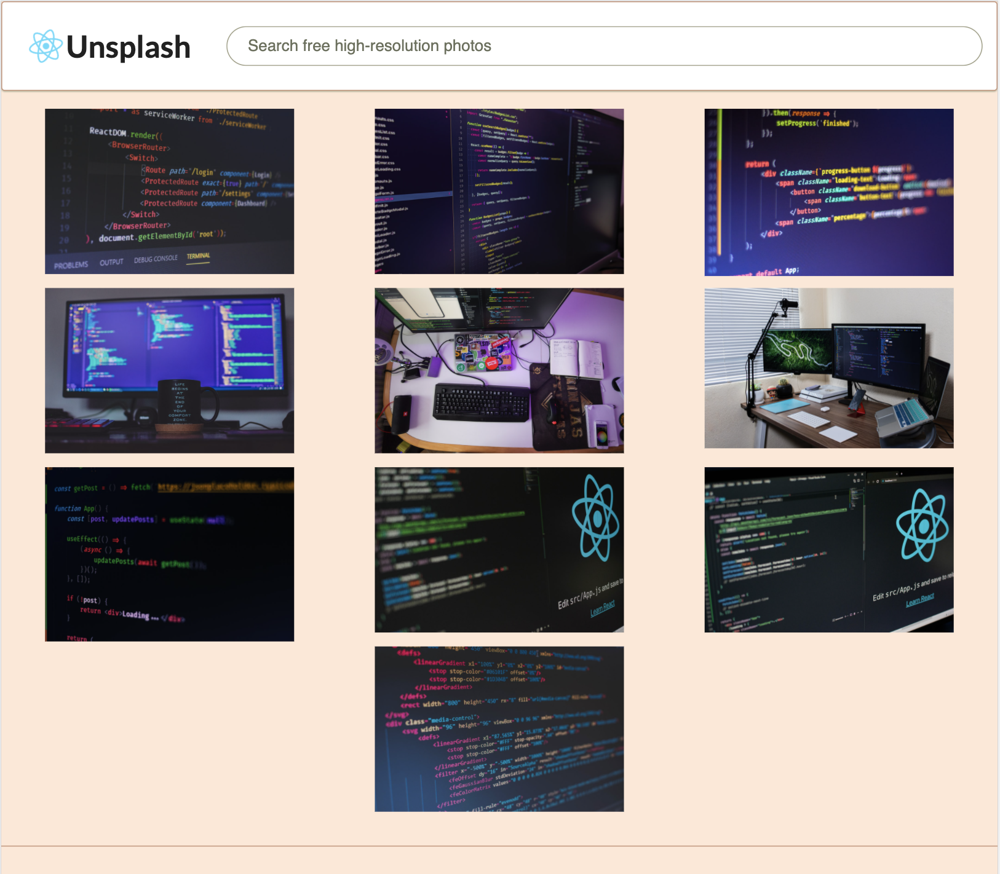

# Search Unsplash for Images with React Hooks

Link to [React Unsplash App](https://jasontoups.github.io/Unsplash-React-Hooks/)

This application is built in React to search the Unsplash API and return a list of images, utilizing Primitive Hooks & Custom Hooks to fetch data.

The images are displayed in a responsive grid, and rows are calculated on the Image Card Component render. 



## Hooks: Primitive & Custom
I've used two Primitive Hooks in this application, and here's how they were used:

### SearchBar.js - Primitive Hook
- useState()

I used `useState()` to handle the state of the SearchBar Component input, to track the term that's being entered in the form to search the YouTube API.

```javascript
const SearchBar = ({ onFormSubmit }) => {
	const [term, setTerm] = useState('')

	const onSubmit = event => {
		event.preventDefault();

		onFormSubmit(term);
	};
```
Here's the form & input JSX in the return statement of the SearchBar Component function:
```javascript
<form onSubmit={onSubmit} className='form'>
  <div className='field'>
    <input
      type='text'
      value={term}
      placeholder={'Search free high-resolution photos'}
      onChange={(event) => setTerm(event.target.value)
      
      }
    />
  </div>
</form>
```
When the input field changes, the `term` state is updated as well.

### App.js - Custom & Primitive Hooks
- useState()
- useEffect() 

I also used `useState()` in the App Component function to handle storing the array of images sent back from the Unsplash API.

```javascript
const [images, search] = useImages('react js');
```

`useImages()` is a *Custom Hook* that I wrote, to handle fetching images.

By using the Primitive Hooks, `useState` & `useEffect`, I wrote a hook that allows us to not only set the default term of the API query by passing in an argument, but also passing in new search terms when another request is made. This makes the custom hook reusable whenever a list of videos are needed from an API.

It's handy to create custom hooks when fetching data. This happens frequently in apps of a larger scale, so I placed `useImages` in the `/hooks` directory.

```javascript
const useImages = (defaultSearchTerm) => {
  const [images, setImages] = useState([]);

  useEffect(() => {
		search(defaultSearchTerm);
	}, [defaultSearchTerm]);
  
  const search = async term => {
		const response = await unsplash
      .get('/search/photos', {
        params: { query: term }
      })
		setImages(response.data.results);
	};

  return [images, search];
};
```
`useEffect()` is a Lifecycle Hook that is called when the App Component mounts initially. It submits the default search term we passed as an *argument* into `useImages` as the search term to make an API request.

-----


## Available Scripts

In the project directory, you can run:

### `npm start`

Runs the app in the development mode.<br />
Open [http://localhost:3000](http://localhost:3000) to view it in the browser.

The page will reload if you make edits.<br />
You will also see any lint errors in the console.

### `npm test`

Launches the test runner in the interactive watch mode.<br />
See the section about [running tests](https://facebook.github.io/create-react-app/docs/running-tests) for more information.

### `npm build`

Builds the app for production to the `build` folder.<br />
It correctly bundles React in production mode and optimizes the build for the best performance.

The build is minified and the filenames include the hashes.<br />
Your app is ready to be deployed!

See the section about [deployment](https://facebook.github.io/create-react-app/docs/deployment) for more information.

### `npm eject`

**Note: this is a one-way operation. Once you `eject`, you can’t go back!**

If you aren’t satisfied with the build tool and configuration choices, you can `eject` at any time. This command will remove the single build dependency from your project.

Instead, it will copy all the configuration files and the transitive dependencies (webpack, Babel, ESLint, etc) right into your project so you have full control over them. All of the commands except `eject` will still work, but they will point to the copied scripts so you can tweak them. At this point you’re on your own.

You don’t have to ever use `eject`. The curated feature set is suitable for small and middle deployments, and you shouldn’t feel obligated to use this feature. However we understand that this tool wouldn’t be useful if you couldn’t customize it when you are ready for it.
